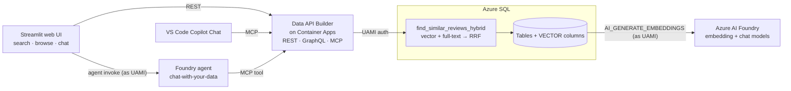

# Chat with your data — Azure SQL + hybrid search + MCP

Deploy a complete "intelligent search over your own data" stack on Azure
with **one command**. A single User-Assigned Managed Identity authenticates
every hop — **no keys, no passwords, no connection secrets in your code.**

```powershell
az login
.\deploy.ps1 -ResourceGroupName rg-sqlrag-dev -NamePrefix sqlrag
```

> First time? Check the [Prerequisites](#prerequisites) (CLI tools + an
> Owner/Contributor role) and the [tunable switches](#useful-switches)
> — region, sample data, and the web UI are all configurable.

When it finishes you have a live SQL database with embedded data, a hosted
**MCP server** your AI tools can call, a web UI to demo it, and a **Foundry
agent** you can chat with — all created in one run.


---

## What you get

| Piece | What it does |
|---|---|
| **Azure SQL Database** | Holds your data **and** its vector embeddings. Entra-only auth. |
| **Azure AI Foundry** | Hosts `text-embedding-3-small` (embeddings) and `gpt-4.1` (the agent's chat model). SQL calls the embedding model as the UAMI. |
| **Hybrid search** | `dbo.find_similar_reviews_hybrid` fuses vector similarity + full-text keyword ranking with Reciprocal Rank Fusion — all inside SQL. |
| **Data API Builder (DAB) on Container Apps** | Exposes the tables and the search procedure as **REST + GraphQL + MCP**, no custom code. See the [DAB overview](https://learn.microsoft.com/azure/data-api-builder/overview). Authenticates to SQL as the UAMI. |
| **Foundry prompt agent** | `chat-with-your-data` — created by `deploy.ps1`, wired to the DAB `/mcp` tool, visible in the new Foundry Agents UI. |
| **Streamlit web UI** | Search + browse tabs (DAB REST) **plus a Chat with Agent tab** that talks to the Foundry agent via the Microsoft Agent Framework SDK. |

The MCP endpoint (`https://<your-dab-app>/mcp`) is the headline: point VS Code
GitHub Copilot Chat or the deployed Foundry agent at it and **chat with your
data**.

---

## How it works



1. **Embed.** Each row's text is embedded by Foundry and stored in a
   `VECTOR(1536)` column. SQL authenticates to Foundry as the UAMI via an
   `EXTERNAL MODEL`, so there are no API keys.
2. **Search.** The stored procedure embeds the incoming query, takes the
   top vector matches and the top full-text matches, and fuses them with
   Reciprocal Rank Fusion — better than either signal alone.
3. **Serve.** DAB runs in a container with the UAMI attached, connects to
   SQL with `Authentication=Active Directory Managed Identity`, and publishes
   everything as [REST](https://learn.microsoft.com/azure/data-api-builder/rest),
   [GraphQL](https://learn.microsoft.com/azure/data-api-builder/graphql), and
   [MCP](https://learn.microsoft.com/azure/data-api-builder/mcp/).
4. **Consume.** The web UI's search/browse tabs call REST; Copilot Chat calls
   MCP; the **Foundry agent** calls the DAB MCP tool, and the web UI's **Chat**
   tab invokes that agent as the UAMI.

For the full design — the RRF math, the embedding model wiring, the agent, and
the identity model — read [docs/ARCHITECTURE.md](docs/ARCHITECTURE.md).

---

## Prerequisites

Install these once, then `az login`. Each `--version` should print.

| Tool | Why | Install (Windows) |
|---|---|---|
| **PowerShell 7+** (`pwsh`) | runs `deploy.ps1` | `winget install Microsoft.PowerShell` |
| **Azure CLI** ≥ 2.60 | deploys Bicep, builds images | `winget install Microsoft.AzureCLI` |
| **Bicep** | infra templates | `az bicep install` |
| **go-sqlcmd** | runs the SQL with Entra auth (`-G`) | `winget install Microsoft.Sqlcmd` |
| **Python 3.12+** | runs the Stage 5 agent setup during deploy, and lets you run/iterate on the web UI locally | `winget install Python.Python.3.12` |

macOS/Linux: use `brew` or the
[Microsoft install docs](https://learn.microsoft.com/cli/azure/install-azure-cli).
You do **not** need Docker — images build in the cloud with `az acr build`.
Python is required: `deploy.ps1` Stage 5 uses the `azure-ai-projects` SDK to
create the Foundry agent, and it's also how you run the web UI locally.

**Permissions & quota.** You need **Owner**, or **Contributor + User Access
Administrator**, on the subscription or resource group (the deploy creates a
role assignment). You also need quota for a small
`text-embedding-3-small` deployment in your region (default `westus`).

---

## Deploy

```powershell
az login
az account set --subscription "<name or GUID>"   # if you have several

.\deploy.ps1 -ResourceGroupName rg-sqlrag-dev -NamePrefix sqlrag
```

`-NamePrefix` is 3–12 lowercase alphanumeric chars; resource names derive
from it plus a stable per-subscription hash, so globally-unique names stay
consistent across re-runs. The deploy is **idempotent** — run it again any
time.

### Useful switches

| Switch | Effect |
|---|---|
| `-SeedSampleData:$false` | Don't seed the demo products/reviews — [bring your own data](byo/README.md) instead. |
| `-DeployWebApp:$false` | Skip the Streamlit UI (just SQL + hosted DAB). |
| `-InstallAutoEmbedTrigger` | Auto-embed new/changed rows via a SQL trigger. |
| `-SkipSqlScripts` | Deploy infra only (e.g. your client can't reach SQL on 1433). |
| `-SkipImageBuild` | Reuse existing ACR images (iterate on Bicep only). |
| `-Location <region>` | Default `westus`. |

When it's done, the URLs and IDs are written to `outputs.json` (gitignored).

---

## Try it

```powershell
$dab = (Get-Content .\outputs.json | ConvertFrom-Json).dabAppUrl

# REST
curl "$dab/api/Product"

# Hybrid search (vector + full-text)
curl -X POST "$dab/api/FindSimilarReviewsHybrid" `
  -H "Content-Type: application/json" `
  -d '{ "queryText": "comfortable chair for long hours", "top": 5 }'
```

DAB also serves a GraphQL endpoint at `$dab/graphql` over the same entities.
For the request/response shapes see the DAB
[REST](https://learn.microsoft.com/azure/data-api-builder/rest) and
[GraphQL](https://learn.microsoft.com/azure/data-api-builder/graphql) docs.

- **Web UI:** open `webAppUrl` from `outputs.json` in a browser — use the
  **Search** and **Browse** tabs, or the **Chat with Agent** tab to talk to
  the Foundry agent. If the chat tab isn't there yet, refresh a few times —
  the web app's new revision takes a moment to start serving after deploy.
- **VS Code Copilot Chat:** add the hosted MCP server to
  [`.vscode/mcp.json`](.vscode/mcp.json) (replace the placeholder URL with
  your `dabAppUrl` + `/mcp`), then use it in agent mode.
- **Foundry agent:** `deploy.ps1` already created it. Chat with it in the web
  UI, the Foundry playground, or locally — see [agent/README.md](agent/README.md).

### Test the web UI locally before deploying it

The Streamlit app in [`app/`](app/app.py) is a thin client — it only calls
DAB's REST endpoint, never SQL or an LLM directly. So you can run and
iterate on it on your laptop against the **hosted DAB**, and only ship the
web container once you're happy with it. Edits hot-reload instantly — much
faster than rebuilding the container each time. This is the path that needs
Python installed locally.

```powershell
# 1. Deploy SQL + embeddings + hosted DAB, but skip the web container
.\deploy.ps1 -ResourceGroupName rg-sqlrag-dev -NamePrefix sqlrag -DeployWebApp:$false

# 2. Run the UI locally against the deployed DAB and iterate
pip install -r app/requirements.txt
$env:DAB_BASE_URL = (Get-Content .\outputs.json | ConvertFrom-Json).dabAppUrl
streamlit run app/app.py
```

The app reads `DAB_BASE_URL` from the environment, so no SQL access or
Azure auth is needed locally — it just makes HTTP calls to DAB's anonymous
REST API.

```powershell
# 3. Happy with it? Ship the web container (idempotent; rebuilds images
#    and updates the container apps in place)
.\deploy.ps1 -ResourceGroupName rg-sqlrag-dev -NamePrefix sqlrag -SkipSqlScripts
```

> The default `deploy.ps1` run already deploys the web app for you. Use the
> `-DeployWebApp:$false` → local-test → redeploy loop only when you want to
> change the UI.


---

## Repo layout

```
deploy.ps1            one-command orchestrator (foundation → SQL → DAB → web UI)
teardown.ps1          deletes the whole resource group
outputs.json          deployment state (gitignored; see outputs.template.json)
infra/                Bicep: foundation.bicep · dab-aca.bicep · webapp-aca.bicep
sql/                  dependency-ordered SQL (00 schema → 22 hybrid search)
dab/                  Data API Builder config + Dockerfile
app/                  Streamlit web UI — search · browse · chat (app.py · Dockerfile · requirements.txt)
agent/                Foundry prompt agent — agent.py · requirements.txt · README.md
byo/                  bring-your-own-data guide (post-deploy)
docs/                 ARCHITECTURE.md · CHANGELOG.md · architecture/ diagrams
```

The `sql/` numbering groups the pipeline: `00–02` schema + sample data,
`10–15` embeddings, `20–22` hybrid search. The orchestrator runs them in
order; you can also run any file by hand with
`sqlcmd -S <fqdn> -d ProductsDB -G -i sql/<file>.sql`.

---

## Cost & cleanup

Everything uses the cheapest viable SKU: SQL serverless `GP_S_Gen5_2` with
60-minute auto-pause, ACR Basic, and Container Apps. Foundry is per-token.
Idle cost is a few cents a day (mostly SQL storage).

```powershell
.\teardown.ps1 -ResourceGroupName rg-sqlrag-dev -AutoApprove
```

---

## Bring your own data

The sample data is just a demo. Point the whole stack at your own table —
embeddings, hybrid search, and MCP tools — without redeploying any
infrastructure. See [byo/README.md](byo/README.md). You can do this whether
or not you seeded the sample data.

---

## Security

The default hosted DAB is **anonymous** — convenient for a demo, but read
[SECURITY.md](SECURITY.md) before exposing the MCP endpoint beyond your
laptop, and never commit `outputs.json` or real URLs into `.vscode/mcp.json`.

---

## Reference

Data API Builder documentation:

- [DAB overview](https://learn.microsoft.com/azure/data-api-builder/overview) — what DAB is and how it works
- [Configuration file reference](https://learn.microsoft.com/azure/data-api-builder/configuration) — the `dab-config.json` schema used in [`dab/`](dab/dab-config.json)
- [REST endpoints](https://learn.microsoft.com/azure/data-api-builder/rest) — query/filter syntax for `/api`
- [GraphQL endpoints](https://learn.microsoft.com/azure/data-api-builder/graphql) — schema and operations at `/graphql`
- [SQL MCP Server](https://learn.microsoft.com/azure/data-api-builder/mcp/) — the `/mcp` tool surface, plus:
  - [DML tools reference](https://learn.microsoft.com/azure/data-api-builder/mcp/data-manipulation-language-tools) — `describe_entities`, `read_records`, `execute_entity`, …
  - [Add descriptions to entities](https://learn.microsoft.com/azure/data-api-builder/mcp/how-to-add-descriptions) — why this repo declares `fields` metadata (see [agent/README.md](agent/README.md#working-with-the-dab-tools))
  - [Deploy to Azure Container Apps](https://learn.microsoft.com/azure/data-api-builder/mcp/quickstart-azure-container-apps)
  - [Use with Azure AI Foundry](https://learn.microsoft.com/azure/data-api-builder/mcp/quickstart-azure-ai-foundry)
