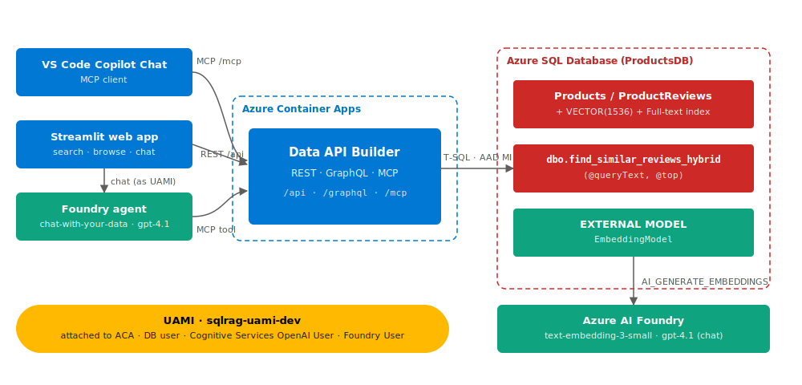
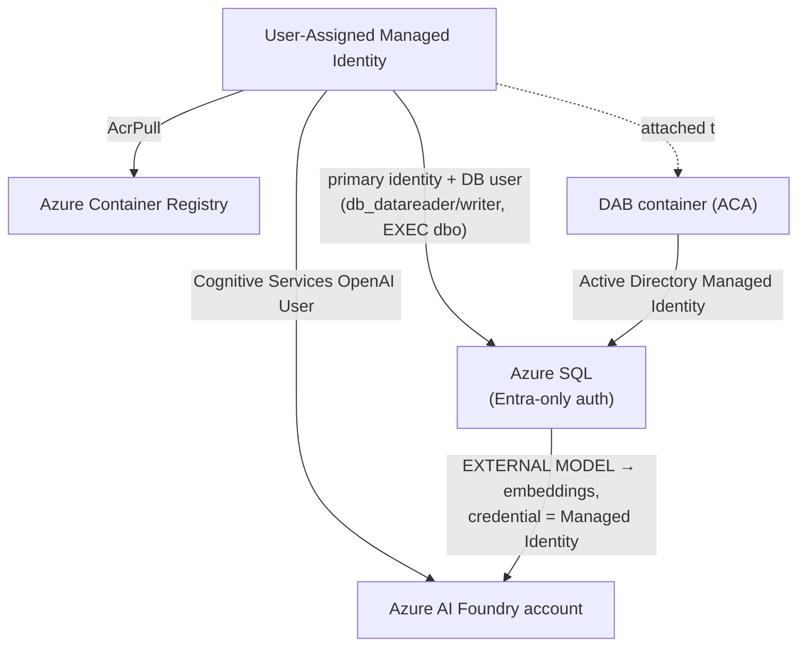
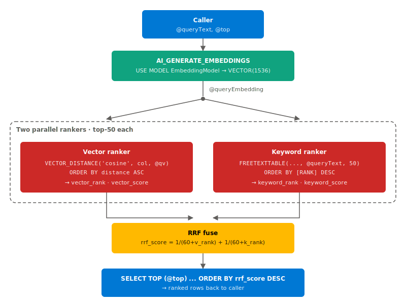
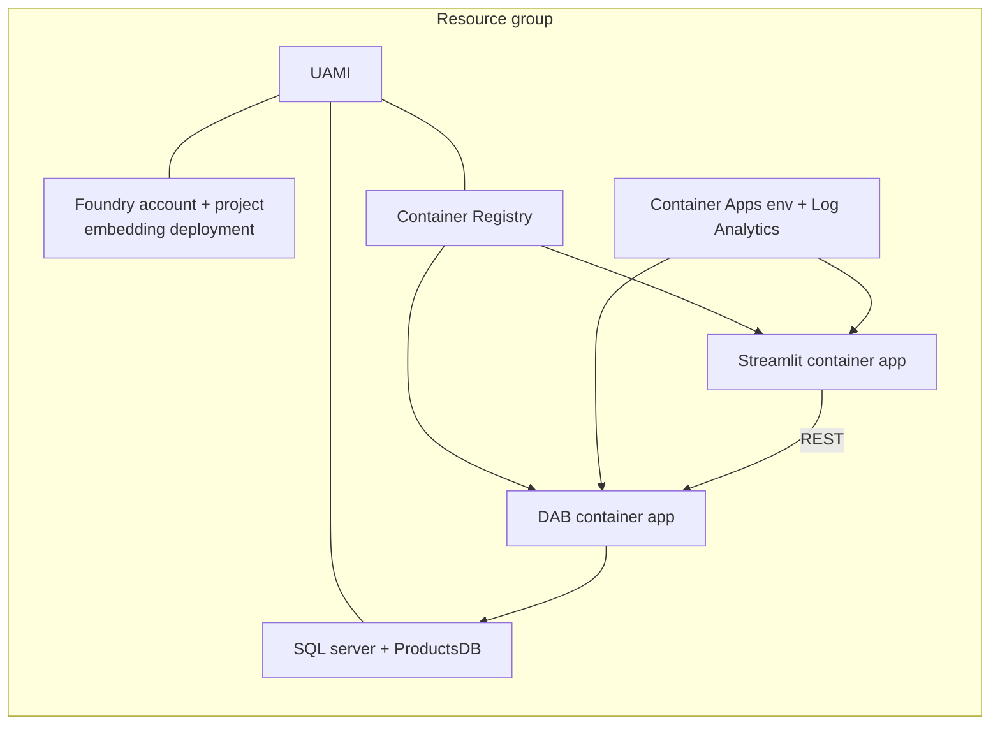

# Architecture

How the "chat with your data" stack is built and why. For the one-command
deploy and quick start, see the [root README](../README.md).

---

## The identity model: one UAMI, no secrets

Every service-to-service call uses the same **User-Assigned Managed Identity
(UAMI)**. Nothing in this repo stores an API key, a SQL password, or a
connection secret in code.

- The **SQL server** has the UAMI as its primary identity, so SQL can mint
  tokens for that identity when it calls Foundry.
- A **database-scoped credential** named after the OpenAI endpoint, with
  `IDENTITY = 'Managed Identity'`, lets `EXTERNAL MODEL` calls authenticate
  as the UAMI — the UAMI holds **Cognitive Services OpenAI User** on the
  Foundry account.
- The **DAB container** has the UAMI attached and connects to SQL with
  `Authentication=Active Directory Managed Identity;User Id=<clientId>`.
  Step 2's `CREATE USER ... FROM EXTERNAL PROVIDER` mapped that identity to a
  database user with the rights DAB needs.
- The same UAMI holds **AcrPull**, so Container Apps pulls the image without
  registry admin credentials.

The result: rotating or revoking one identity governs the entire stack.

---

## The data and embedding pipeline

1. **Schema** ([`sql/00-create-schema.sql`](../sql/00-create-schema.sql)).
   `dbo.Products` and `dbo.ProductReviews`. The reviews table has a
   `ReviewEmbedding VECTOR(1536)` column, created up front but left `NULL`.
2. **External model** ([`sql/12-create-external-model.sql`](../sql/12-create-external-model.sql)).
   Registers `EXTERNAL MODEL EmbeddingModel` pointing at the Foundry
   `text-embedding-3-small` deployment, authenticating via the
   database-scoped credential (the UAMI).
3. **Backfill** ([`sql/14-backfill-embeddings.sql`](../sql/14-backfill-embeddings.sql)).
   Calls `AI_GENERATE_EMBEDDINGS(text USE MODEL EmbeddingModel)` for every
   row with a `NULL` embedding and stores the vector.
4. **Optional trigger** ([`sql/15-create-auto-embed-trigger.sql`](../sql/15-create-auto-embed-trigger.sql)).
   Re-embeds rows automatically on `INSERT`/`UPDATE` so embeddings never go
   stale. Off by default; enable with `-InstallAutoEmbedTrigger`.

`AI_GENERATE_EMBEDDINGS` + `EXTERNAL MODEL` is the modern, in-engine path.
(An older approach wrapped `sp_invoke_external_rest_endpoint` by hand; this
repo uses the newer `EXTERNAL MODEL` form throughout.)

---

## Hybrid search: vector + full-text, fused with RRF

Vector search finds *semantic* matches ("comfy seat" ≈ "comfortable chair");
full-text search nails *exact keywords* (model numbers, rare terms). Each
misses what the other catches, so
[`sql/21-create-hybrid-search-sp.sql`](../sql/21-create-hybrid-search-sp.sql)
runs both and combines them with **Reciprocal Rank Fusion**:

$$\text{RRF}(d) = \sum_{r \in \text{rankers}} \frac{1}{k + \text{rank}_r(d)}, \quad k = 60$$

`dbo.find_similar_reviews_hybrid(@queryText, @top)`:

1. Embeds `@queryText` with `EmbeddingModel`.
2. Takes the **top 50 by cosine distance** (`VECTOR_DISTANCE('cosine', …)`).
3. Takes the **top 50 by keyword rank** (`FREETEXTTABLE`, backed by the
   full-text index from [`sql/20-create-fulltext-index.sql`](../sql/20-create-fulltext-index.sql)).
4. `FULL OUTER JOIN`s the two lists and scores each row by the RRF formula.
5. Returns the top `@top` rows ordered by fused score.

RRF needs no score normalization between the two very different scales
(cosine distance vs. full-text rank) — it only uses each list's *rank
position*, which is why it's robust.

---

## Serving: Data API Builder on Container Apps

[Data API Builder](https://learn.microsoft.com/azure/data-api-builder/)
turns SQL objects into REST, GraphQL, and **MCP** endpoints from a single
config file ([`dab/dab-config.json`](../dab/dab-config.json)):

| Entity | Source | Exposed as |
|---|---|---|
| `Product` | `dbo.Products` (table) | REST/GraphQL read |
| `ProductReview` | `dbo.ProductReviews` (table) | REST/GraphQL read |
| `FindSimilarReviewsHybrid` | `dbo.find_similar_reviews_hybrid` (stored proc) | REST `POST` / GraphQL mutation / MCP tool |

- The connection string is `@env('SQL_CONNECTION_STRING')`, injected by the
  Container App from a secret — so the **same image** runs against any SQL
  server without rebuilding.
- The image is built in the cloud with `az acr build` (no local Docker) and
  layered on `mcr.microsoft.com/azure-databases/data-api-builder`.
- `ASPNETCORE_FORWARDEDHEADERS_ENABLED=true` makes Kestrel honor ACA's
  `X-Forwarded-Proto: https`, so DAB builds `https://` redirect URLs (needed
  for stored-procedure `201` responses).

The MCP runtime block (`"mcp": { "enabled": true }`) is what makes the
stored procedure callable as a tool by Copilot Chat and Foundry agents.

---

## Deployment topology

[`deploy.ps1`](../deploy.ps1) provisions this in four stages, each
idempotent:

| Stage | Template / scripts | Produces |
|---|---|---|
| 1. Foundation | [`infra/foundation.bicep`](../infra/foundation.bicep) | UAMI, SQL, Foundry, embedding model, role assignment |
| 2. SQL data plane | [`sql/*.sql`](../sql) via `sqlcmd -G` | schema, embeddings, hybrid search SP |
| 3. Hosted DAB | `az acr build` + [`infra/dab-aca.bicep`](../infra/dab-aca.bicep) | ACR, image, ACA env, DAB app |
| 4. Web UI | `az acr build` + [`infra/webapp-aca.bicep`](../infra/webapp-aca.bicep) | Streamlit app in the same ACA env |

ACR is created by the script (not Bicep) so images exist before the apps
reference them. Both container apps share one ACA environment and one
registry. Stage 4 reuses the AcrPull grant from stage 3, so it adds no role
assignment.

---

## Bring your own data

The sample products/reviews are a demo. The same machinery —
`EmbeddingModel`, the full-text catalog, the UAMI's DB rights — works for any
table with a text column. [`byo/README.md`](../byo/README.md) walks through
adding a `VECTOR(1536)` column, backfilling, building a table-specific hybrid
SP, and exposing it through DAB without redeploying infrastructure.

