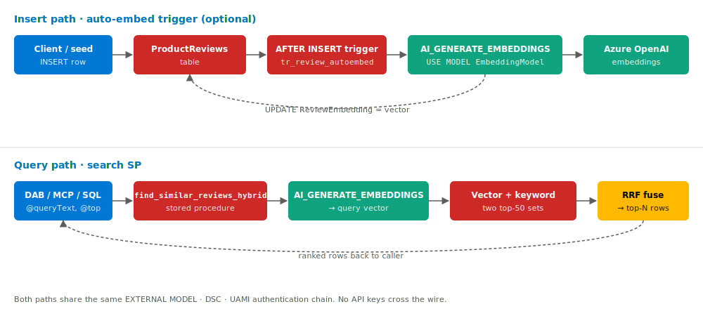

# 02 — Data and embedding flow

How a row of free text becomes a searchable vector. The whole pipeline
runs **inside Azure SQL** — the application tier never sees an
embeddings request or an API key.

## Insert path (auto-embed trigger)

When the optional `AFTER INSERT` trigger is installed, every new row
flows top-lane in the diagram above:

1. Caller does an `INSERT INTO dbo.ProductReviews(...)`.
2. Trigger fires; calls `AI_GENERATE_EMBEDDINGS(@ReviewText USE MODEL EmbeddingModel)`.
3. The EXTERNAL MODEL uses the DSC to acquire an MI bearer token, then POSTs to the `embedding` deployment.
4. Azure OpenAI returns a 1536-dim vector; the trigger writes it back to the row's `ReviewEmbedding` column.

Without the trigger you call [`05-backfill-embeddings.sql`](../../steps/02-embeddings-in-sql/sql/05-backfill-embeddings.sql)
in batch — same model, same auth, just driven from a cursor instead of
a trigger.

## Query-time path (search SP)

The bottom lane in the diagram. The SP takes only `(@queryText, @top)`,
uses `AI_GENERATE_EMBEDDINGS` to vectorize the query against the same
registered model, runs vector + keyword rankers, and fuses the two
rankings with RRF before returning the top-N rows.

## Why this design

- **No secrets cross the wire.** The DSC is `IDENTITY = 'Managed
  Identity'`. SQL acquires its own bearer token via the UAMI and never
  stores an API key.
- **One round-trip per call.** `AI_GENERATE_EMBEDDINGS` is a built-in
  function once the `EXTERNAL MODEL` is registered. Callers don't have
  to know the OpenAI endpoint or deployment name — those are baked into
  the model registration.
- **The trigger is optional.** You can use the manual backfill
  ([`sql/14-backfill-embeddings.sql`](../../sql/14-backfill-embeddings.sql))
  in batch jobs and skip the trigger, or install the trigger and have
  every new row auto-embed. Both paths use the exact same model.
- **Idempotency.** `AI_GENERATE_EMBEDDINGS` is deterministic for the
  same input + model deployment, so re-running the backfill on already-
  embedded rows is a no-op.

## Where each piece is built

| Element                                   | File |
|-------------------------------------------|------|
| `DATABASE SCOPED CREDENTIAL` (MI)         | [`sql/11-create-credential.sql`](../../sql/11-create-credential.sql) |
| `EXTERNAL MODEL EmbeddingModel`           | [`sql/12-create-external-model.sql`](../../sql/12-create-external-model.sql) |
| Backfill cursor                           | [`sql/14-backfill-embeddings.sql`](../../sql/14-backfill-embeddings.sql) |
| Auto-embed trigger                        | [`sql/15-create-auto-embed-trigger.sql`](../../sql/15-create-auto-embed-trigger.sql) |
| Search SP that uses the model             | [`sql/21-create-hybrid-search-sp.sql`](../../sql/21-create-hybrid-search-sp.sql) |

## Source

Diagram is hand-authored SVG ([`02-data-and-embedding-flow.svg`](02-data-and-embedding-flow.svg)). Original visual source kept at [`02-data-and-embedding-flow.drawio`](02-data-and-embedding-flow.drawio).
