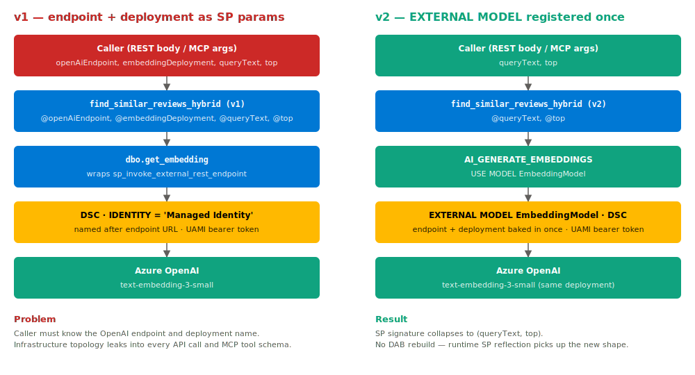

# 04 — Auth: v1 (per-call params) vs v2 (registered EXTERNAL MODEL)

The tutorial originally exposed the OpenAI endpoint and deployment
name as **stored procedure parameters**, so every caller had to know
them. The current staged flow removes those parameters by registering
the deployment as a SQL `EXTERNAL MODEL` in step 2. Same auth
(UAMI + DSC), but no infrastructure config leaks into client calls.

## v1 — endpoint and deployment as SP parameters

**Problem.** The caller has to know the OpenAI endpoint and the
embedding deployment name. Those are infrastructure details that have
no business being part of an MCP tool's argument schema or a REST
request body. They also leak the cloud topology to every consumer of
the API.

## v2 — `EXTERNAL MODEL` registered once, callers pass only intent

**What changed.** The OpenAI endpoint and deployment name are now
properties of the registered `EmbeddingModel` inside Azure SQL. The
SP signature collapses to `(queryText, top)`. The DSC and the UAMI
auth flow are exactly the same as v1 — only the surface area changed.

## Side-by-side

| Concern | v1 | v2 |
|---|---|---|
| SP params | `openAiEndpoint`, `embeddingDeployment`, `queryText`, `top` | `queryText`, `top` |
| MCP `execute_entity` body | `{ entity, parameters: { openAiEndpoint, embeddingDeployment, queryText, top } }` | `{ entity, parameters: { queryText, top } }` |
| REST POST body | 4 fields | 2 fields |
| Embedding mechanism | `sp_invoke_external_rest_endpoint` path | `AI_GENERATE_EMBEDDINGS USE MODEL ...` |
| Credential | DSC named after endpoint | DSC referenced from the EXTERNAL MODEL |
| Required SQL grants for caller MI | `EXECUTE ANY EXTERNAL ENDPOINT`, `REFERENCES ON DSC` | same — **plus** `EXECUTE ON EXTERNAL MODEL :: EmbeddingModel` |
| Where the endpoint URL lives | Hardcoded into every caller's payload | Inside `CREATE EXTERNAL MODEL` only |
| DAB rebuild required | — | None. DAB reflects the SP signature at runtime |
| Bicep changes | — | None |

## Where this is built

| File | What it sets up |
|---|---|
| [`infra/foundation.bicep`](../../infra/foundation.bicep) | UAMI, SQL server, embedding deployment, role assignment (Cognitive Services OpenAI User) |
| [`sql/11`–`sql/12`](../../sql) | DB user for the UAMI; credential; registers `EXTERNAL MODEL EmbeddingModel` |
| [`sql/21-create-hybrid-search-sp.sql`](../../sql/21-create-hybrid-search-sp.sql) | The hybrid SP that uses `AI_GENERATE_EMBEDDINGS` with `EmbeddingModel` |
| [`infra/dab-aca.bicep`](../../infra/dab-aca.bicep) | UAMI attached to the ACA app so DAB authenticates to SQL with the same identity end-to-end |

## Source

Diagram is hand-authored SVG ([`04-auth-v1-v2.svg`](04-auth-v1-v2.svg)). Original visual source kept at [`04-auth-v1-v2.drawio`](04-auth-v1-v2.drawio).
